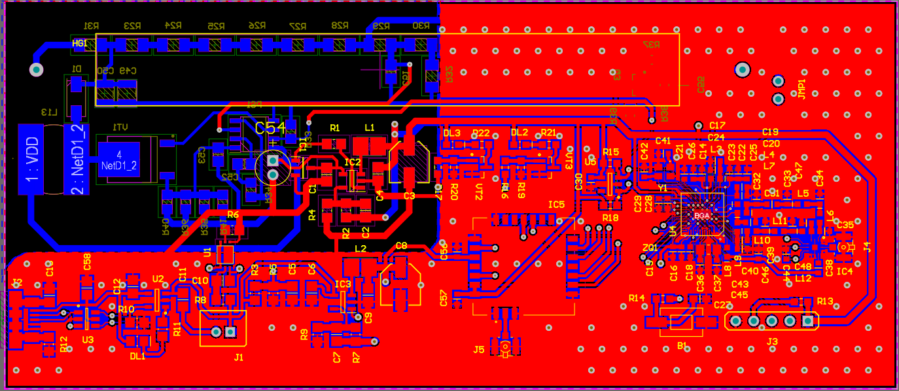
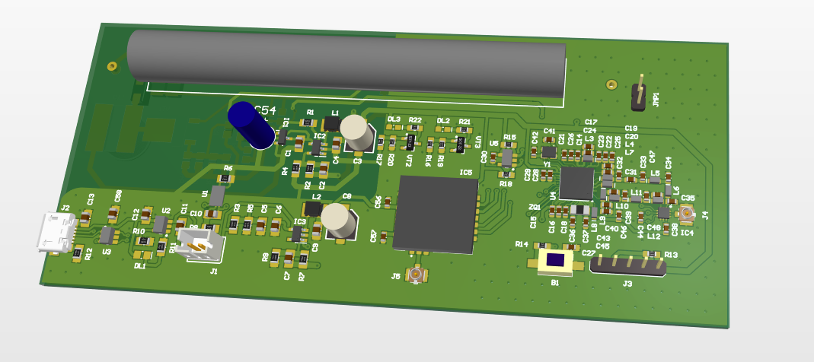
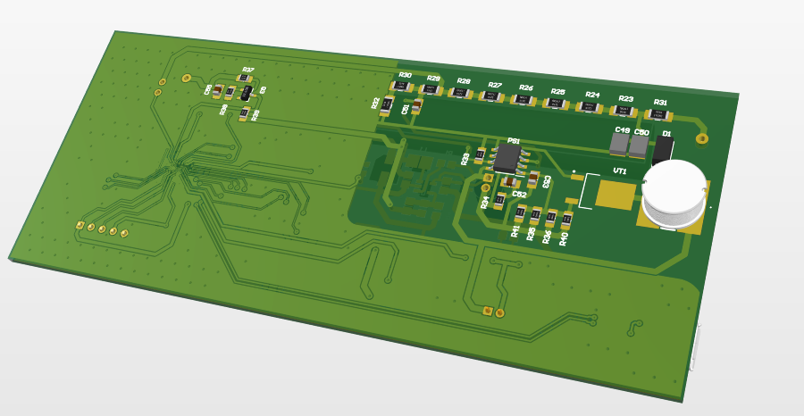
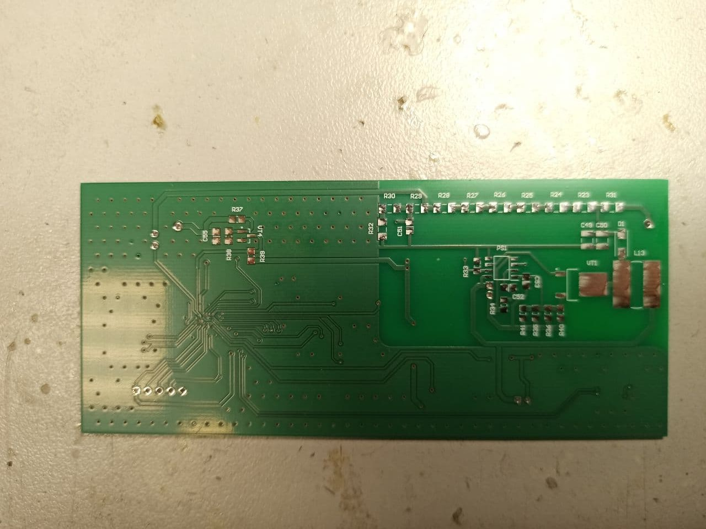
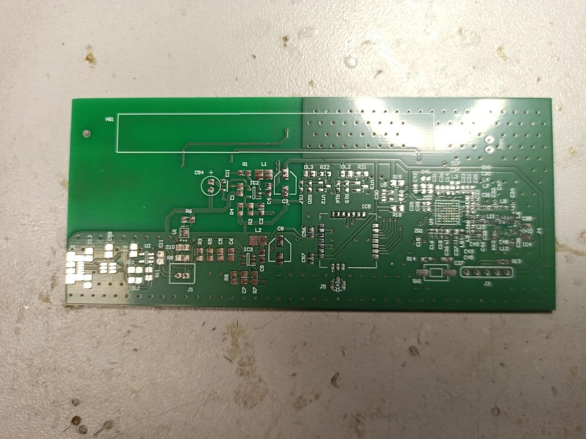

# Lora_Gayger
This board contains a Geiger Muller counter and a microcontroller with a LoRa (Long Range) transceiver.

Schemes in Altium Designer: [Schemes](AD_Lora_Gayger_v1.1/PDF/Job1.PDF)

Altium Designer Project: [AD_Project](AD_Lora_Gayger_v1.1/)

# Board in editor:

# 3D model of board in Altium Designer
## Front:

## Back:

# 

